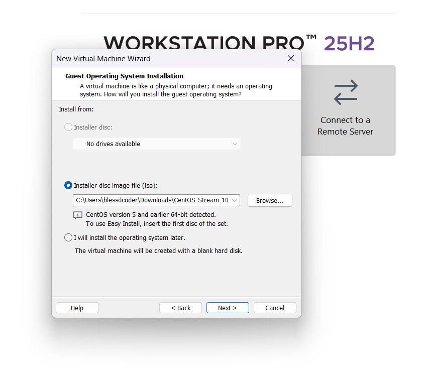
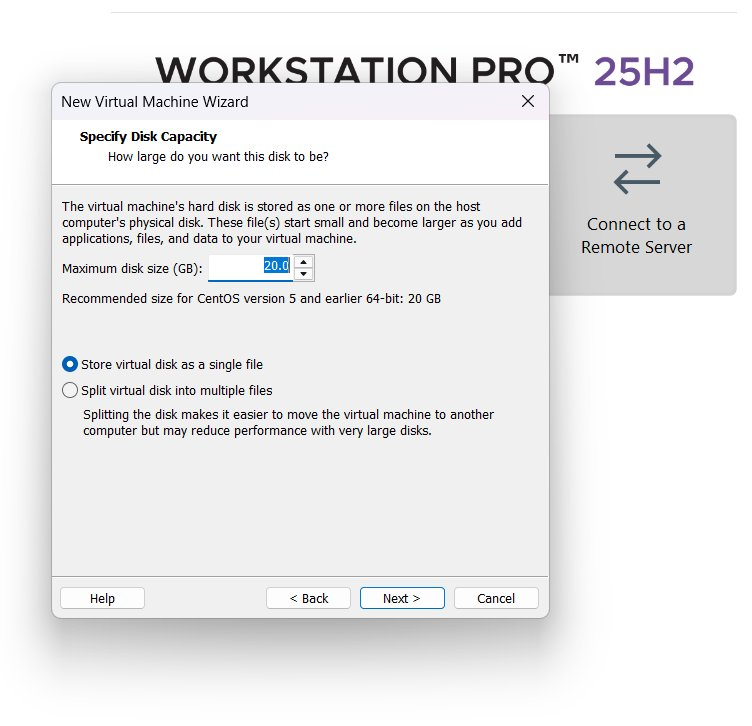
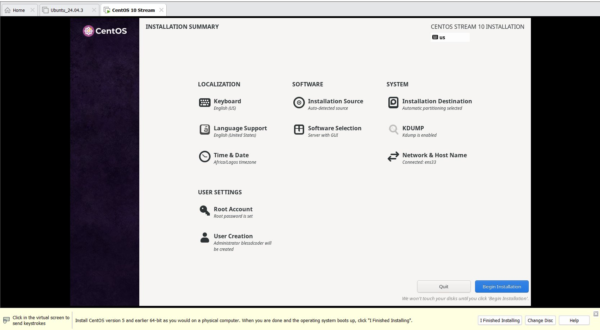
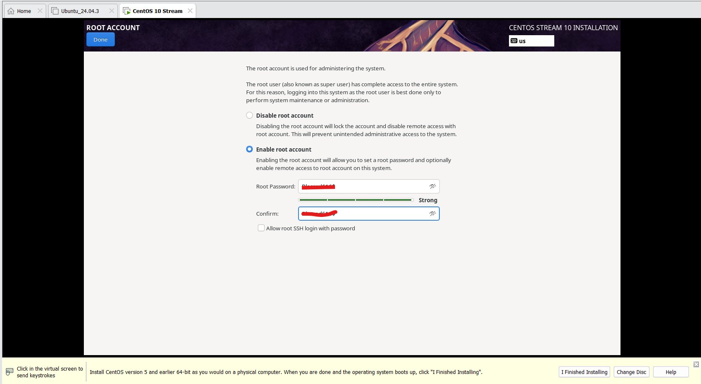
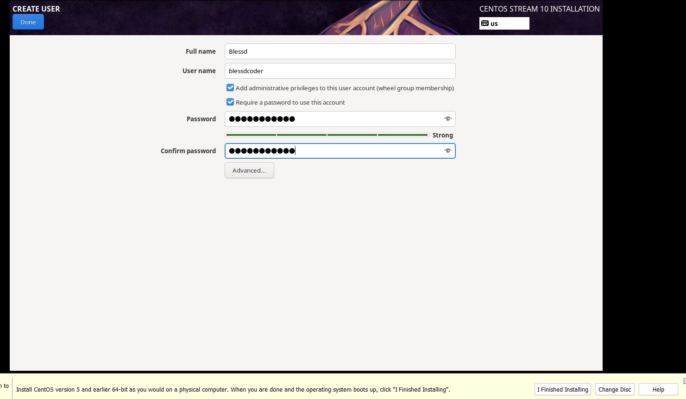
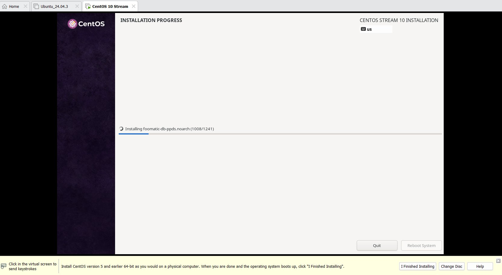
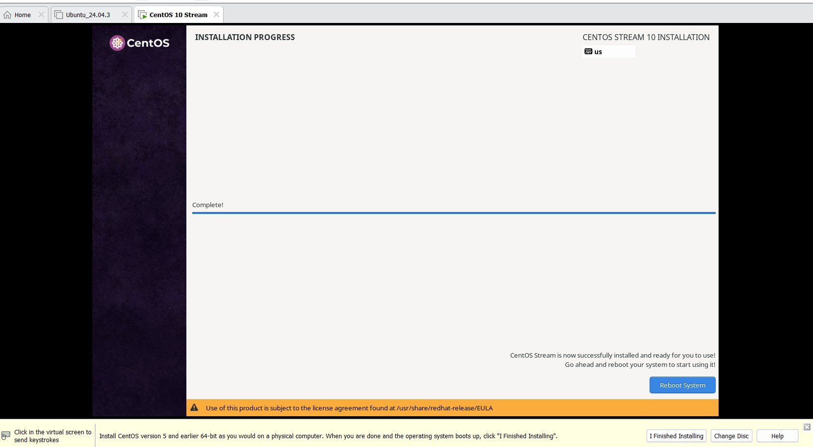
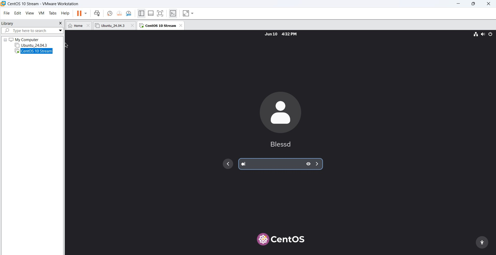
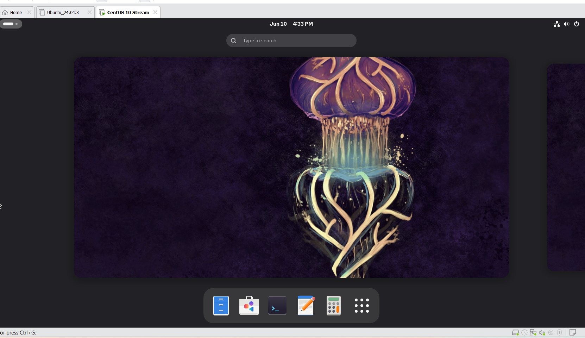
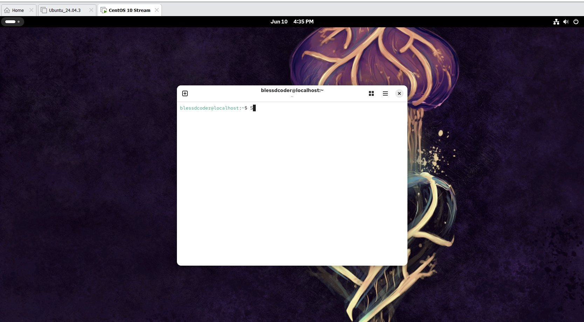

# Distro Comparison — Ubuntu vs CentOS Stream
> Part of Chapter 03: Linux Basics and System Startup
> Both installed on VMware Workstation Pro 25H2

---

## Why I Installed Two Distros

The course covers three Linux distribution families. I decided to
install one from the Debian family (Ubuntu) and one from the Red
Hat family (CentOS Stream) to see the differences firsthand.

---

## Installing CentOS Stream 10

**Step 1 — Loading the ISO into VMware**

**Step 2 — Setting disk size**

**Step 3 — Installation summary screen**

This screen was different from Ubuntu. CentOS shows everything
on one page — localization, software selection, disk setup, and
user settings all at once before you begin installing.

**Step 4 — Setting up the root account**

CentOS asks you to set a root password separately. Ubuntu does
not expose the root account the same way during installation.

**Step 5 — Creating a user**

**Step 6 — Installation in progress**

**Step 7 — Installation complete**

**Step 8 — CentOS login screen after reboot**

**Step 9 — CentOS desktop**

**Step 10 — CentOS terminal**

---

## What Was Different Between Ubuntu and CentOS

| | Ubuntu 24.04 LTS | CentOS Stream 10 |
|---|---|---|
| Family | Debian | Red Hat |
| Package manager | apt | dnf |
| Installer style | Step by step wizard | Single summary page |
| Root account | Hidden by default | Set explicitly during install |
| Desktop | GNOME | GNOME |
| Feel | More beginner friendly | More server/enterprise focused |

---

## What I Noticed

The Ubuntu installer felt smoother and more guided. CentOS felt
more technical — it gave you more control upfront but also
expected you to know what you were doing.

Both ended up with a working Linux system. The desktop looked
similar on both since they both use GNOME, but the underlying
tools and package managers are different.

This is why the course teaches all three families — they behave
differently and you will encounter all of them in real work
environments.
