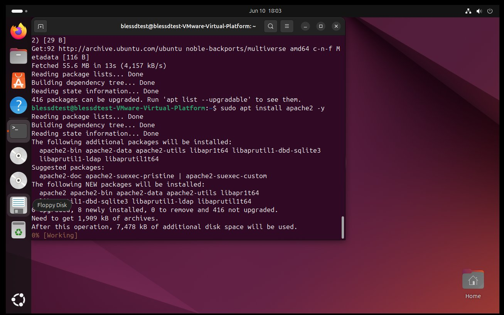
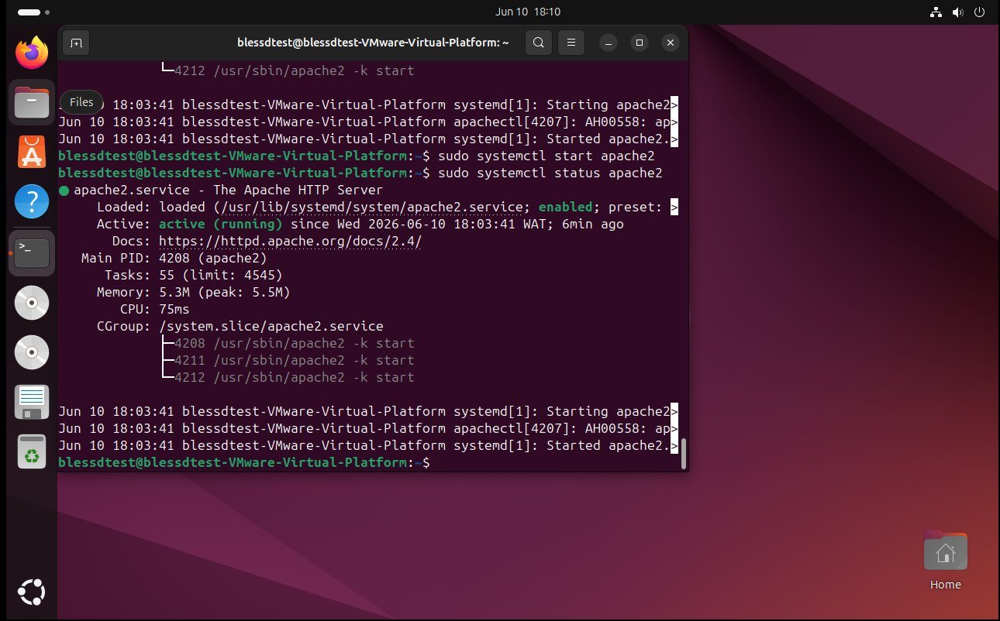
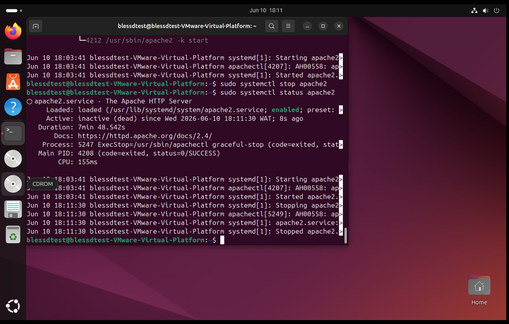
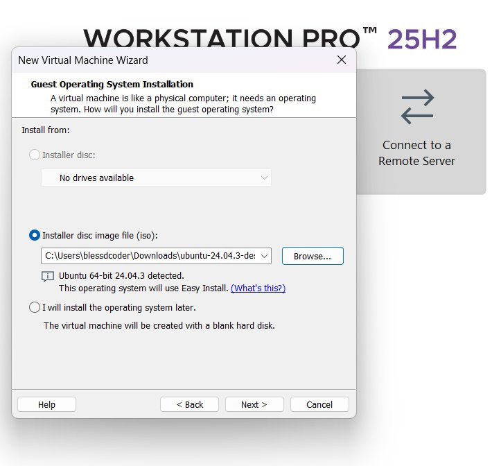
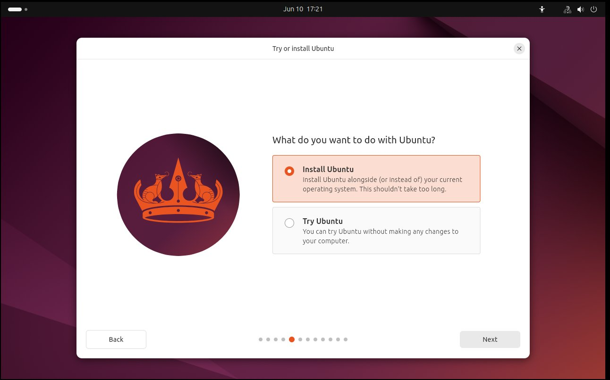
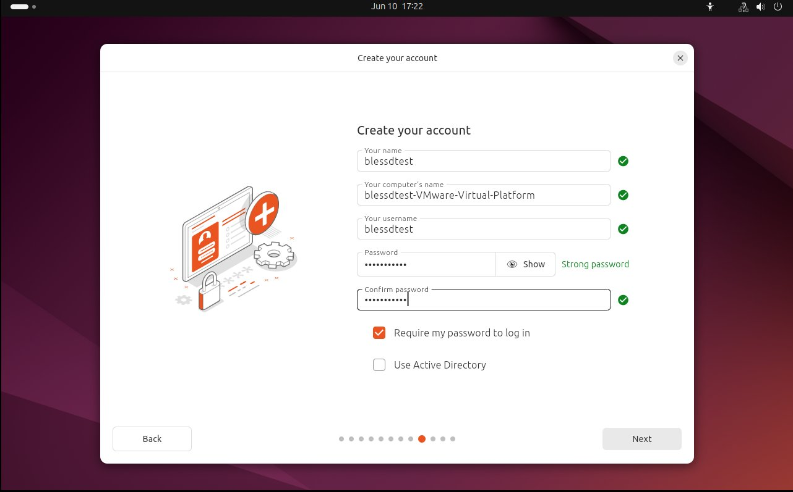
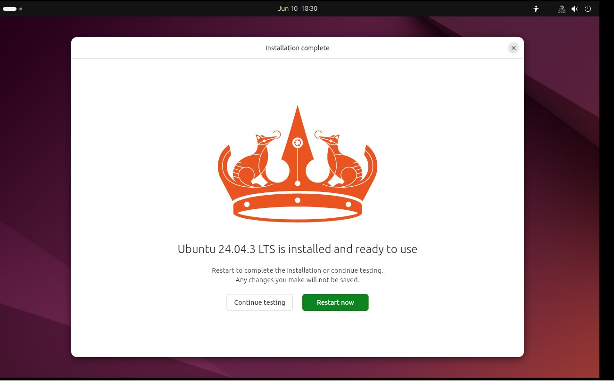
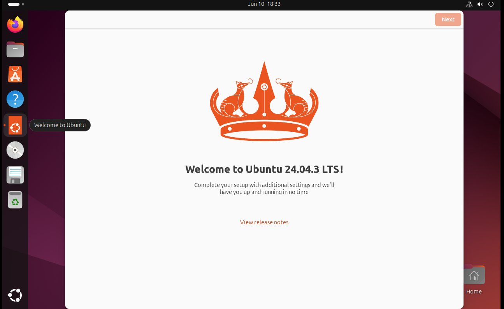
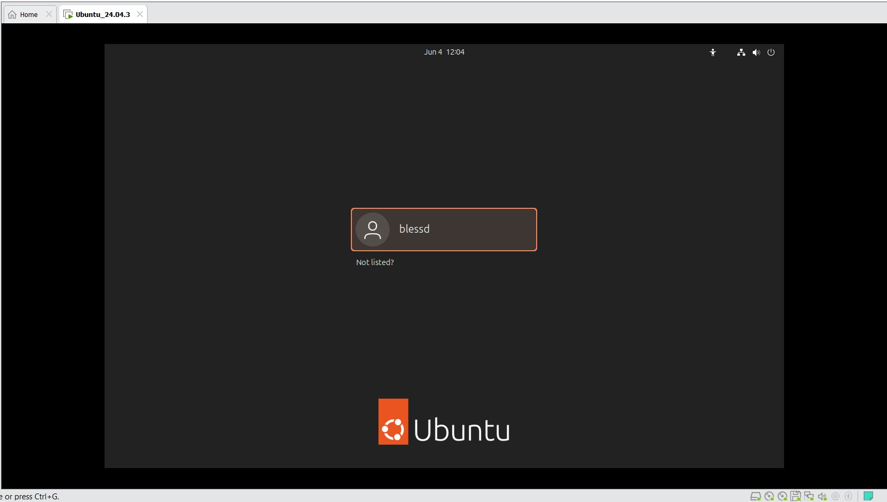

# Chapter 03: Linux Basics and System Startup
> Course: LFS101 — Introduction to Linux | Linux Foundation
> Date completed: June 2026

---

## What This Chapter Is About

This chapter explains what happens when you turn on a Linux computer.
It also covers how the Linux filesystem is laid out, how Linux gets
installed on a machine, and how to manage basic services like a web
server using systemd.

---

## The Boot Process

When you press the power button something called the boot process
starts. It is a sequence of steps that happen one after another
before you see the login screen.

Here is how it goes:

**BIOS or UEFI**
The first thing that runs when you power on is either BIOS or UEFI.
This is built into the motherboard. It checks that the hardware is
working and then looks for something to boot from.

BIOS is the older version. UEFI is the newer one. Most modern
computers use UEFI.

**MBR**
Once BIOS or UEFI finds the hard drive it looks at a small section
at the very start of the disk called the Master Boot Record. This
points to the next step.

**Boot Loader — GRUB**
GRUB is the program that loads Linux. If you have ever seen a menu
appear when starting a Linux machine asking which system to boot —
that is GRUB. It loads the Linux kernel into memory.

**The Kernel**
The kernel is the core of Linux. After GRUB loads it, the kernel
sets up the hardware and mounts the filesystem so the system can
start reading files.

**Initial RAM Disk — initramfs**
This is a small temporary filesystem that helps the kernel get fully
set up before the real system takes over.

**init and systemd**
After the kernel is ready it starts the very first process on the
system. On modern Linux this is called systemd. It becomes process
number 1 and is responsible for starting all the other services
the system needs to run.

**Login Prompt**
After everything is started you finally see the login screen.

The full sequence looks like this: Power On → BIOS/UEFI → MBR → GRUB → Kernel → initramfs → systemd → Login

---

## /sbin/init and Services

Before systemd existed, Linux used a program called /sbin/init to
start services after the kernel loaded. It was the first process
to run and it read a config file to know what to start.

The problem with the old init system was that it started services
one at a time, in order. This made the system slow to boot.

---

## Linux Startup Alternatives: Why the Industry Evolved

Over time different systems were created to replace the old init
because it was too slow and limited. The main ones were:

- **Upstart** — developed by Ubuntu to start services faster
- **systemd** — the modern standard used by almost all Linux
  distributions today

systemd won because it starts services in parallel and does a lot
more than just boot management.

---

## systemd Features

systemd is not just a boot manager. It handles:

- Starting and stopping services
- Logging system activity
- Managing the system clock
- Mounting filesystems

You interact with systemd using a tool called **systemctl**.

Common systemctl commands used in this chapter:

```bash
# Check the status of a service
sudo systemctl status apache2

# Start a service
sudo systemctl start apache2

# Stop a service
sudo systemctl stop apache2
```

---

## Lab 3.1 — Apache Web Server Status

This was the first hands-on lab in the course. The goal was to
practice using systemctl to manage a service — in this case the
Apache web server.

Here is what I did step by step:

**Step 1 — Install Apache**
I installed Apache on my Ubuntu VM using the package manager.



**Step 2 — Check status**
I ran the status command to see if Apache was running.

**Step 3 — Start the service**
I started Apache using systemctl and confirmed it was active.



**Step 4 — Stop the service**
I stopped Apache and confirmed it was no longer running.



This lab made systemd click for me. Seeing the service go from
inactive to active (running) in the terminal output made it
real instead of just theory.

---

## The Linux Filesystem

This was something that confused me at first because it is
completely different from Windows.

On Windows you have drives like C:\ and D:\. On Linux there is
only one starting point called root, written as `/`. Everything
on the system lives under root. Even external drives and USB
sticks get mounted inside the root directory tree.

Here are the main folders and what they do:

| Folder | What It Is For |
|--------|---------------|
| `/` | Root — the top of the whole filesystem |
| `/home` | Where each user's personal files are kept |
| `/etc` | System and application config files |
| `/var` | Files that change regularly like logs |
| `/bin` | Basic commands that all users can run |
| `/sbin` | Commands used for system administration |
| `/tmp` | Temporary files that get cleared on reboot |
| `/boot` | The kernel and bootloader files |
| `/dev` | Device files for hardware like hard drives |

---

## Installing Linux

Linux can be installed in a few different ways:
- Directly on your computer (called bare metal)
- Inside a virtual machine
- On a cloud server

I installed two distributions as part of this chapter:
- **Ubuntu 24.04 LTS** — Debian family
- **CentOS Stream 10** — Red Hat family

See `distro-comparison.md` for the full installation screenshots
and notes on what was different between the two.

**Ubuntu installation steps:**













---

## What I Found Interesting

I never thought about what happens between pressing power and
seeing the screen. Now I know there are actually several steps
happening and each one is a separate program passing control
to the next.

The lab with Apache was also interesting. Using systemctl to
start and stop a real service made the whole systemd section
make sense immediately.

---

## What Confused Me

I kept mixing up BIOS and UEFI. The simple version is:
BIOS is old, UEFI is new. Most computers today use UEFI.

I also did not fully understand what initramfs was at first.
The way I think about it now is that it is a temporary helper
that loads just enough for the kernel to get going before
handing over to the real system.

---

## Chapter Complete: ✅ Yes
